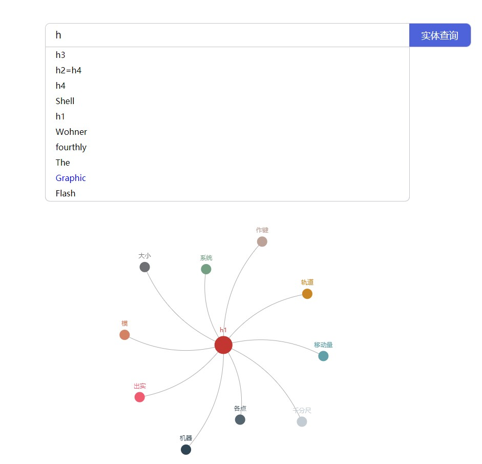

#### 主页样例如下


#### 项目运行
项目中有两个运行文件
- run.py
- run.sh


#### 安装环境
```
$ python3.8 -m venv venv  

$ . venv/bin/activate

$ python -m pip install --upgrade pip  //使用python3.6时候pip版本对应不上出错时候使用

$ pip install -r requirements.txt

```
运行方法一[此方法用于前端运行，可以实时查看log信息]：
```
python3 run.py
```

运行方法二[此方法用于后台运行，根据项目目录下，nohup.out文件查看log信息]：

启动服务
```
bash run.sh  --start
```
关闭服务
```
bash run.sh  --stop
```
重启服务
```
bash run.sh  --restart
```
